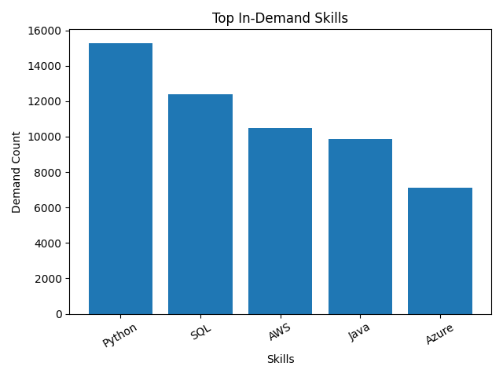
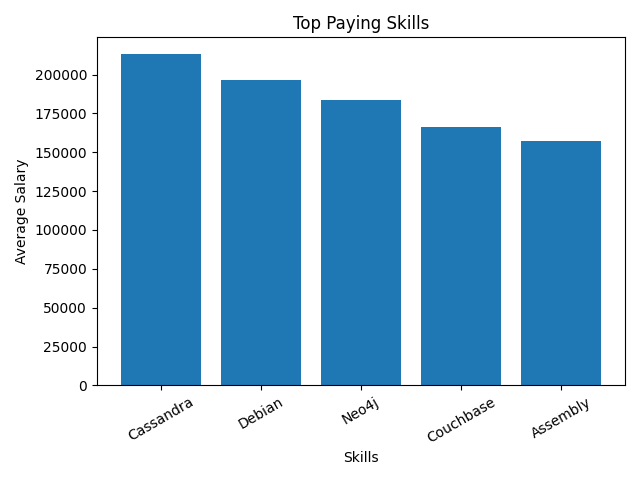
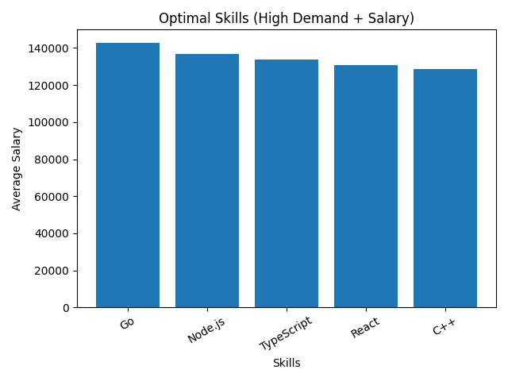

# Introduction
This project explores the software engineering job market using SQL to uncover insights into high-paying roles, in-demand technical skills, and optimal skill combinations. The aim is to help aspiring software engineers understand which skills and roles provide the best career opportunities.

SQL queries: Check them out here [project_sql folder](/project_sql/)
# Background
The software engineering field is highly competitive, with a wide range of technologies and specialisations. It can be difficult to determine:

Which programming languages and tools are most valuable
Which roles offer the highest salaries
How skill demand aligns with compensation

This project analyses real job posting data to answer these questions and guide smarter career decisions.

### The question I want to answer with the SQL queries
1. What are the top paying software engineer jobs?
2. What skills are required for these top paying jobs?
3. What skills are most in demand for software engineer?
4. Which skills are associated with higher salaries?
5. What are the most optimal skills to learn?

# Tools I Used

- **SQL:** The backbone of my analysis, enabling me to efficiently query structured job data and extract meaningful insights.
- **PostgreSQL:** The database system used to store and manage large-scale job posting datasets, ensuring reliable and scalable data handling.
- **Visual Studio Code:** My primary development environment for writing, testing, and refining SQL queries.
- **Git & GitHub:** Used for version control and project management, allowing me to track changes, organise my workflow, and showcase my work professionally.
# The Analysis  

### 1. Top Paying Software Engineering Jobs  
- Identified the highest-paying software engineering roles by filtering job postings with valid salary data.  
- Focused on roles that offer strong compensation to understand where the best opportunities lie.  
- Highlighted companies and positions that consistently offer competitive salaries.  

| Job Title                                   | Company           | Avg Salary ($) |
|--------------------------------------------|------------------|---------------|
| Senior Software Engineer                   | Datavant         | 225,000       |
| Engineering                                | Huckleberry Labs | 205,000       |
| Senior Software Engineer, Full Stack       | SmarterDx        | 205,000       |
| Senior Software Engineer, Server Security  | MongoDB          | 200,000       |
| Senior Ruby Engineer                       | Orbis            | 200,000       |
| Staff Frontend Engineer                    | Webflow          | 191,000       |
| Staff Software Engineer, AI                | Pulley           | 185,000       |
| Director of Software Engineer              | Robert Half      | 182,500       |

📌 **Insight:** High-paying roles are dominated by senior and staff-level positions, with strong emphasis on backend systems, scalability, and cloud infrastructure.

---

### 2. Skills Required for Top Paying Jobs  
- Analysed which technical skills are most commonly required in high-paying roles.  
- Linked job postings with their associated skill sets using joins.  
- Identified premium skills (e.g., backend development, cloud technologies, distributed systems).  

| Skill         | Category        |
|--------------|----------------|
| Python       | Backend / Data |
| AWS          | Cloud          |
| JavaScript   | Frontend       |
| TypeScript   | Frontend       |
| React        | Frontend       |
| Node.js      | Backend        |
| Snowflake    | Data           |
| Airflow      | Data           |
| DynamoDB     | Cloud / DB     |
| Elasticsearch| Search / Data  |

📌 **Insight:** Top-paying roles require a **hybrid skillset across backend, cloud, and frontend**, reinforcing the importance of being a well-rounded engineer.

---

### 3. Most In-Demand Skills  
- Measured the frequency of each skill across all job postings.  
- Identified core technologies that employers consistently look for.  
- Highlighted foundational skills such as programming languages and databases.  

📌 **Insight:** Python, SQL, and AWS dominate demand, showing that strong fundamentals in programming and cloud technologies are essential across most roles.  

> ⚙️ *Graph generated using GPT (matplotlib) based on SQL query results.*

---

### 4. Top Paying Skills  
- Calculated the average salary associated with each skill.  
- Ranked skills based on their earning potential.  
- Identified niche and high-value technologies that command higher salaries.  

📌 **Insight:** Specialised technologies such as Cassandra, Neo4j, and distributed databases command significantly higher salaries, indicating a premium on niche expertise.  

> ⚙️ *Graph generated using GPT (matplotlib) based on SQL query results.*

---

### 5. Optimal Skills (High Demand + High Salary)  
- Combined demand and salary data to find the most valuable skills.  
- Identified skills that are both widely used and highly paid.  
- Provided insights into the best skill combinations for maximizing career opportunities.  

📌 **Insight:** Skills like Go, Node.js, and TypeScript provide the best balance between demand and salary, making them highly strategic for career growth.  

> ⚙️ *Graph generated using GPT (matplotlib) based on SQL query results.*

# What I learned
From this project, several key lessons emerged:

1. **Data-Driven Decision Making**: Using SQL to analyse real job market data allowed me to move beyond assumptions and base conclusions on actual trends and evidence.

2. **Not All Skills Are Equal**: While many skills are widely used, only a subset significantly impacts salary. High-paying roles tend to require more specialised and technical expertise.

3. **Importance of Cloud & Backend Skills**: Technologies like AWS, distributed systems, and backend-focused tools consistently appear in both high-paying and high-demand categories.

4. **Full-Stack Skillsets Are Valuable**: Top-paying roles often require a combination of frontend, backend, and data-related skills rather than a single area of expertise.

5. **SQL as a Core Engineering Skill**: Even in software engineering roles, SQL plays a critical role in analysing, querying, and understanding structured data.

# Conclusion

## Insights  

From the analysis, several general insights emerged:

1. **Top-Paying Software Engineering Jobs**: The highest-paying roles are predominantly senior or staff-level positions, often exceeding $180K, with strong demand in backend, AI, and system scalability domains.

2. **Skills for Top-Paying Jobs**: High-paying roles frequently require expertise in backend development, cloud platforms (AWS, Azure), and scalable system design, highlighting the importance of building depth in technical skills.

3. **Most In-Demand Skills**: Python, SQL, AWS, and Java are among the most востребованные skills, indicating that strong programming and cloud fundamentals are essential for most software engineering roles.

4. **Skills with Higher Salaries**: Specialised technologies such as Cassandra, Neo4j, and distributed database systems are associated with higher salaries, reflecting a premium on niche expertise.

5. **Optimal Skills for Job Market Value**: Skills like Go, Node.js, TypeScript, and React provide a strong balance of demand and salary, making them highly valuable for engineers looking to maximise career opportunities.

## Closing Thoughts  

This project strengthened my ability to use SQL for real-world data analysis while also providing valuable insights into the software engineering job market. The findings highlight the importance of approaching skill development strategically, focusing not only on what is popular but also on what delivers the greatest value in terms of salary and career growth.  

By leveraging data to guide decision-making, aspiring software engineers can better position themselves in a competitive job market. Prioritising a mix of strong fundamentals and high-value specialised skills can significantly improve both employability and long-term career progression. Ultimately, this analysis reinforces the importance of continuous learning and adapting to evolving technologies within the software engineering industry.